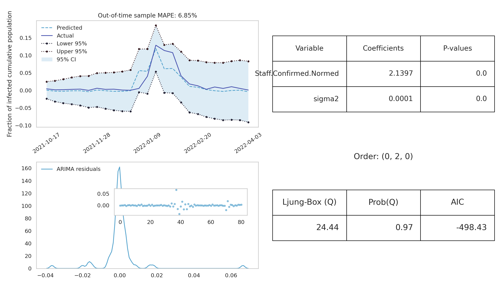

# forecasting-covid-prisons
Time series forecasting results from my Data Science 2 class project (at The University of Vermont)

All code in this repository is original code. Actual research was performed in `project_main.py`, but this can be hard
to follow without visuals. To provide some intuitive insight into my data science process, check out the attached notebook
`demo-forecasting-covid-prisons.ipynb` which will walk through my process of cleaning, transforming, and modeling the
data, and my main findings.

Pictured below is a sample visual for one of my fitted ARIMAX models, visualizing
the out-of-time cross validation prediction accuracy of the fitted model on unseen
data.

In this project, I attempt to model new weekly cases of COVID-19 amongst the state prison population in California and Washington using an ARIMAX modeling framework. Under this framework, I attempted to model the *Residents* time series (incarcerated people in the state prison system) using two potential explanatory variables: The time series of *Staff* cases, and the time series of *Statewide* cases. 

In the attached notebook, `demo-forecasting-covid-prisons.ipynb`, I walk through how I performed exploratory data analysis of the three time series variables, flagged and cleaned any flawed data, transformed the data, and modeled the *Residents* time series using one or more of the explantory variables. I show *Out-Of-Time* cross validation predictions to compare the predictive accuracy (MAPE) of models against one another, to aid in model selection for the best model, and show a few figures of the fitting process and predictive modeling steps.

From this project, I found that the *Staff* variable could best explain the *Residents* time series, better than a baseline model using just *Residents* by itself, and better than the *State* time series.

Data sources are the UCLA Covid Behind Bars Data Project found [here](https://github.com/uclalawcovid19behindbars/data)
and the New York Times found [here](https://github.com/nytimes/covid-19-data).
